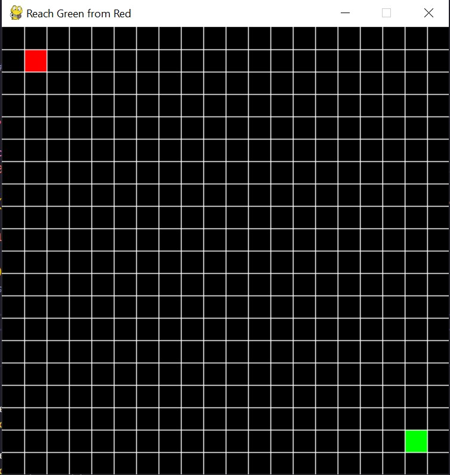
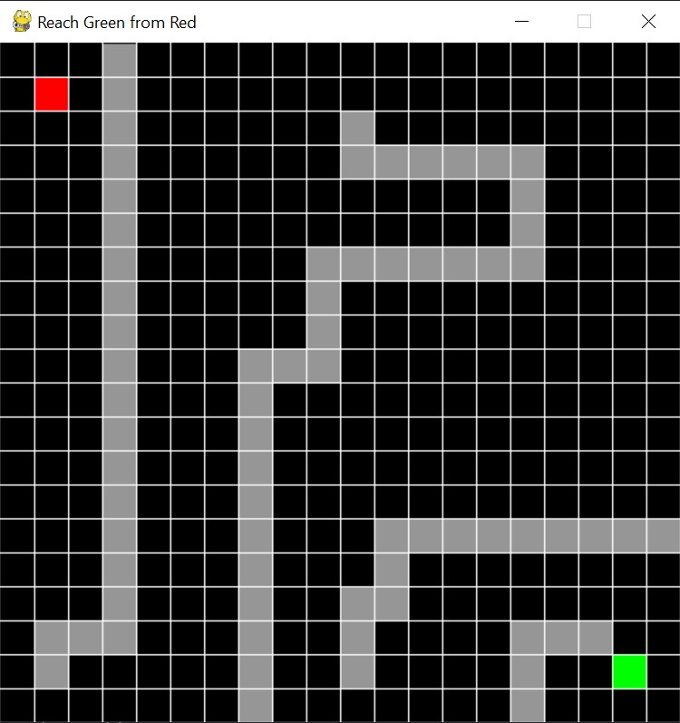

## A python program to implement A* path finding algorithm

#### ALGORITHM -

OPEN - the set of nodes to be evaluated

CLOSED - the set of nodes already evaluated

add the start node to open

f_cost - heuristic cost

loop:

	current = node in OPEN with lowest f_cost
	
	remove current from OPEN
	
	add current to CLOSED
	

	if current is the target node: //path has been found
		return

	for each neighbour of the current node:
		if neighbour is not traversable or neighbour is in CLOSED:
			skip to the next neighbout
		if new path to neighbour is shorter OR neigbour is not in OPEN:
			set f_cost of neighbour
			set parent of neighbour to current
			if neighbour is not in OPEN:
				add neighbour to OPEN

Author - Vedant Tilwani
